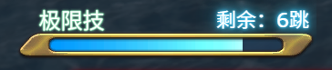
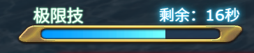

<p align="center">
  
</p>
<h1 align="center"></h1>

<p align="center">
  <a href="/README.zh.md">简体中文</a>
  |
  <strong>English</strong>
</p>

[](https://github.com/vitejs/vite)
[](https://github.com/vuejs/core)
[](https://github.com/microsoft/TypeScript)

A simple but effective ACT OverlayPlugin overlay that calculates and displays the remaining cooldown time of the `Limit Break` in Final Fantasy XIV PvP combats.

## Usage

Before getting started, you need to install and properly configure both `ACT` and `OverlayPlugin`.

1. In `OverlayPlugin`, create a new overlay, select `Custom Overlay`, and set the type to `Mini Parse`.
2. Set the overlay URL (see details below).
3. Adjust the overlay’s position, size, and scale to your preference.

> \[!TIP]
> The overlay will automatically hide when you are outside PvP instances.<br>
> You can go to the `Wolves' Den Pier` for testing.

### Available Overlay URLs

Choose an overlay URL according to your preference.

* To display **“Remain: xx ticks”**<br>
  
  ```
  https://infsein.github.io/pvp-lb-monitor/?lang=en&mode=tick
  ```
* To display **“Remain: xx sec”**<br>
  
  ```
  https://infsein.github.io/pvp-lb-monitor/?lang=en&mode=sec
  ```

> \[!TIP]
> You may have noticed that you can adjust the overlay’s display style by changing the `UrlParams` at the end of the link.<br>
> If you’re interested, please refer to the [Full List of Parameters](./doc/url-params.md).

## FAQ

* **Q: Why does it show “JOB NOT FOUND”?** <br>
  A: In rare cases, the overlay cannot retrieve the required data. You may need to **switch your job once** to resume functionality.

* **Q: Why does the remaining seconds/ticks fluctuate drastically sometimes?** <br>
  A: Certain PvP modes (e.g., Frontline) affect Limit Break gauge accumulation speed.<br>
  Please refer to the official PvP guide for details.

## License

This project currently does not have an open-source license and is provided solely for community security review.<br>
Without explicit authorization, modification and redistribution are prohibited.

> \[!CAUTION]
> Commercial use is strictly forbidden.
